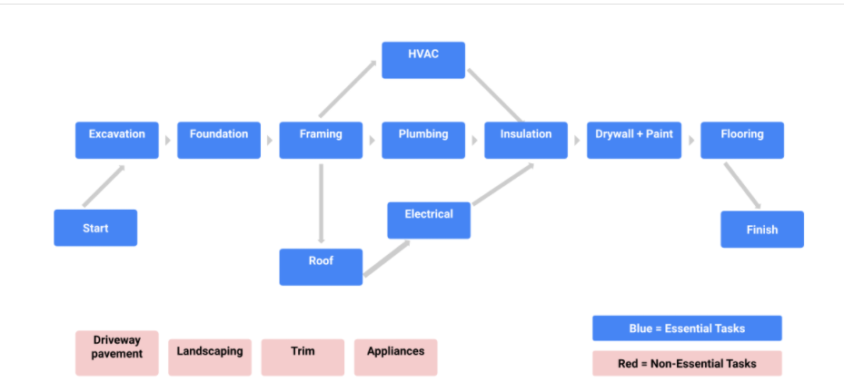
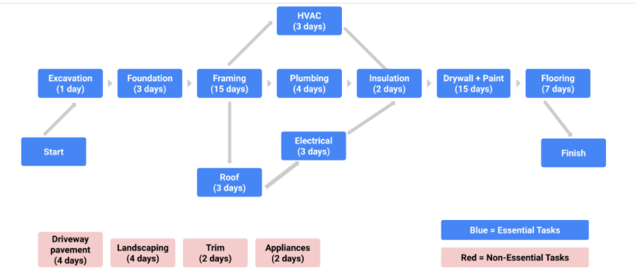

## Creating a critical path
As you’ve just learned, the critical path refers to the list of required project milestones you must reach to complete the project schedule, as well as the mandatory tasks that contribute to the completion of each milestone. You can think of the critical path as a framework that tells you, the project manager, where you are, where you are headed, and when you will get there. 

## Why the critical path is critical
The critical path helps you determine the essential tasks that need to be completed on your project to meet your end goal and how long each task will take. The critical path also provides a quick reference for critical tasks by revealing which tasks will impact your project completion date negatively if their scheduled finish dates are late or missed. A critical path can help you define the resources you need, your project baselines, and any flexibility you have in the schedule. 
## How to create a critical path
Each project you work on will be different, but there are some general steps for creating a critical path that are applicable to most projects.

## Step 1: Capture all tasks 
When you first start working on your project schedule, you will capture all of the tasks associated with the completion of the effort. Remember to use the key planning documents you have created to get you to this point, such as your work breakdown structure (WBS). The main goal in this step is to make sure that you aren’t missing a key piece of work that is required to complete your project. When creating a critical path, focus on the essential, “need to do” tasks, rather than the “nice to do” tasks that aren’t essential for the completion of the project. Here is an example of critical tasks for building the structure of a house:

Task
- A) Excavation
- B) Foundation
- C) Framing
- D) Roof
- E) Plumbing
- F) Heating, ventilation, and air conditioning (HVAC)
- G) Electrical 
- H) Insulation
- I) Drywall + Paint
- J) Flooring

## Step 2: Set dependencies 
Now that you have captured all of your critical tasks in list form, arrange those tasks in order of completion by identifying dependencies. To determine dependencies, figure out which tasks must be completed before other tasks can start. For example, you can’t paint the outside of a house before the house is built, so the task of framing the walls must come before the task of painting them. Identifying dependencies is key to a successful project schedule. 

To figure out dependencies for each task, ask:

- Which task needs to take place before this task?
- Which task can be finished at the same time as this task?
- Which task needs to happen right after this task?

Once you have answered these questions, you can list these dependencies next to your list of tasks:

| Task | Dependency|
| ----------- | ----------- |
| A) Excavation |  |
|B) Foundation	|A) Excavation|
|C) Framing |	B) Foundation |
| D) Roof |	C) Framing |
| E) Plumbing |	C) Framing |
| F) HVAC |	C) Framing |
| G) Electrical | 	C) Framing |
| H) Insulation	| E) Plumbing, F) HVAC, G) Electrical |
| I) Drywall + Paint	| H) Insulation | 
| J) Flooring	| I) Drywall + Paint |

Step 3: Create a network diagram
One common way to visualize the critical path is by creating a network diagram. Network diagrams, like the example below, sequence tasks in the order in which they need to be completed, based on their dependencies. These diagrams help visualize:

The path of the work from the start of the project (excavation) to the end of the project (flooring)
Which tasks can be performed in parallel (e.g., HVAC and plumbing) and in sequence (e.g., plumbing then insulation)
Which non-essential tasks are NOT on the critical path

Step 4: Make time estimates
After determining tasks and dependencies, consult key stakeholders to get accurate time estimates for each task. This is a crucial step in determining your critical path. If your time estimates are significantly off, it may cause the length of your critical path to change. Time estimates can be reviewed and updated throughout the project, as necessary. 

|Task	        |Duration	  |Dependency|
| ----------- | ----------- | ----------- |
| A) Excavation	|     1 Day | |
| B) Foundation	|     3 Days |	A) Excavation|
| C) Framing	  |     15 Days |	B) Foundation|
| D) Roof	      |     3 Days |	C) Framing|
| E) Plumbing	  |     4 Days |	C) Framing|
| F) HVAC	      |     3 Days |	C) Framing|
| G) Electrical |     3 Days |	C) Framing|
| H) Insulation	|     2 Days |	E) Plumbing, F) HVAC, G) Electrical|
| I) Drywall + Paint|	15 Days |	H) Insulation|
| J) Flooring	  |     7 Days |	I) Drywall + Paint|
Step 5: Find the critical path 
Now that you have your estimated durations for each task, add that information to your network diagram:

If you add up the durations for all of your “essential” tasks and calculate the longest possible path, you can determine your critical path. In your calculation, only include the tasks that, if they go unfinished, will impact the project’s finish date. In this example, if the “non-essential” tasks—like landscaping and driveway pavement—are not completed, the house structure completion date will not be impacted. 

You can also calculate the critical path using two common approaches: the forward pass and the backward pass. These techniques are useful if you are asked to identify the earliest and latest start dates (the earliest and latest dates on which you can begin working on a task) or the slack (the amount of time that task can be delayed past its earliest start date without delaying the project).

- The forward pass refers to when you start at the beginning of your project task list and add up the duration of the tasks on the critical path to the end of your project. When using this approach, start with the first task you have identified that needs to be completed before anything else can start. 
- The backward pass is the opposite—start with the final task or milestone and move backwards through your schedule to determine the shortest path to completion. When there is a hard deadline, working backwards can help you determine which tasks are actually critical. You may be able to cut some tasks—or complete them later—in order to meet your deadline. 

You can read more about these each of these concepts and critical path calculation methods in the following articles:

# es
## Creación de una ruta crítica
Como acaba de aprender, el camino crítico se refiere a la lista de hitos necesarios del proyecto que debe alcanzar para completar el calendario del proyecto, así como las tareas obligatorias que contribuyen a la finalización de cada hito. Puede pensar en el camino crítico como un marco que le indica a usted, el director del proyecto, dónde está, hacia dónde se dirige y cuándo llegará. 

## Por qué es fundamental el camino crítico
El camino crítico le ayuda a determinar las tareas esenciales que deben completarse en su proyecto para alcanzar el objetivo final y el tiempo que llevará cada tarea. El camino crítico también proporciona una referencia rápida para las tareas críticas al revelar qué tareas tendrán un impacto negativo en la fecha de finalización de su proyecto si sus fechas de finalización programadas se retrasan o se pierden. Una ruta crítica puede ayudarle a definir los recursos que necesita, las líneas de base del proyecto y cualquier flexibilidad que tenga en el calendario. 
## Cómo crear un camino crítico
Cada proyecto en el que trabaje será diferente, pero hay algunos pasos generales para crear un camino crítico que son aplicables a la mayoría de los proyectos.

## Paso 1: Capturar todas las tareas 
Cuando empiece a trabajar en el calendario de su proyecto, capturará todas las tareas asociadas a la realización del esfuerzo. Recuerde utilizar los documentos de planificación clave que ha creado para llegar a este punto, como su estructura de desglose del trabajo (EDT). El objetivo principal de este paso es asegurarse de que no falta ninguna pieza clave necesaria para completar el proyecto. Al crear un camino crítico, concéntrese en las tareas esenciales, "necesarias para hacer", en lugar de las tareas "agradables para hacer" que no son esenciales para la finalización del proyecto. He aquí un ejemplo de tareas críticas para la construcción de la estructura de una casa:

Task
- A) Excavation
- B) Foundation
- C) Framing
- D) Roof
- E) Plumbing
- F) Heating, ventilation, and air conditioning (HVAC)
- G) Electrical 
- H) Insulation
- I) Drywall + Paint
- J) Flooring

## Paso 2: Establecer dependencias 
Ahora que ha capturado todas sus tareas críticas en forma de lista, organice esas tareas en orden de realización identificando las dependencias. Para determinar las dependencias, averigüe qué tareas deben completarse antes de que puedan comenzar otras. Por ejemplo, no se puede pintar el exterior de una casa antes de construirla, por lo que la tarea de enmarcar las paredes debe ser anterior a la de pintarlas. Identificar las dependencias es la clave para el éxito de la programación de un proyecto. 

Para averiguar las dependencias de cada tarea, pregúntese:

- ¿Qué tarea debe llevarse a cabo antes de esta tarea?
- ¿Qué tarea puede terminarse al mismo tiempo que esta?
- ¿Qué tarea debe realizarse justo después de esta tarea?

Una vez que haya respondido a estas preguntas, puede enumerar estas dependencias junto a su lista de tareas:

| Task | Dependency|
| ----------- | ----------- |
| A) Excavation |  |
|B) Foundation	|A) Excavation|
|C) Framing |	B) Foundation |
| D) Roof |	C) Framing |
| E) Plumbing |	C) Framing |
| F) HVAC |	C) Framing |
| G) Electrical | 	C) Framing |
| H) Insulation	| E) Plumbing, F) HVAC, G) Electrical |
| I) Drywall + Paint	| H) Insulation | 
| J) Flooring	| I) Drywall + Paint |
Paso 3: Crear un diagrama de red
Una forma habitual de visualizar el camino crítico es crear un diagrama de red. Los diagramas de red, como el ejemplo siguiente, secuencian las tareas en el orden en que deben completarse, basándose en sus dependencias. Estos diagramas ayudan a visualizar:

La trayectoria del trabajo desde el inicio del proyecto (excavación) hasta el final del proyecto (pavimentación)
Qué tareas pueden realizarse en paralelo (por ejemplo, la climatización y la fontanería) y en secuencia (por ejemplo, la fontanería y luego el aislamiento)
Qué tareas no esenciales NO están en el camino crítico

Paso 4: Hacer estimaciones de tiempo
Tras determinar las tareas y las dependencias, consulte a los principales interesados para obtener estimaciones de tiempo precisas para cada tarea. Este es un paso crucial para determinar el camino crítico. Si las estimaciones de tiempo son significativamente erróneas, la longitud de la ruta crítica puede cambiar. Las estimaciones de tiempo pueden revisarse y actualizarse a lo largo del proyecto, según sea necesario. 

Paso 4: Hacer estimaciones de tiempo
Tras determinar las tareas y las dependencias, consulte a los principales interesados para obtener estimaciones de tiempo precisas para cada tarea. Este es un paso crucial para determinar el camino crítico. Si las estimaciones de tiempo son significativamente erróneas, la longitud de la ruta crítica puede cambiar. Las estimaciones de tiempo pueden revisarse y actualizarse a lo largo del proyecto, según sea necesario. 

|Task	        |Duration	  |Dependency|
| ----------- | ----------- | ----------- |
| A) Excavation	|     1 Day | |
| B) Foundation	|     3 Days |	A) Excavation|
| C) Framing	  |     15 Days |	B) Foundation|
| D) Roof	      |     3 Days |	C) Framing|
| E) Plumbing	  |     4 Days |	C) Framing|
| F) HVAC	      |     3 Days |	C) Framing|
| G) Electrical |     3 Days |	C) Framing|
| H) Insulation	|     2 Days |	E) Plumbing, F) HVAC, G) Electrical|
| I) Drywall + Paint|	15 Days |	H) Insulation|
| J) Flooring	  |     7 Days |	I) Drywall + Paint|

Paso 5: Encontrar el camino crítico 
Ahora que tiene las duraciones estimadas para cada tarea, añada esa información a su diagrama de red:

Si suma las duraciones de todas sus tareas "esenciales" y calcula el camino más largo posible, podrá determinar su camino crítico. En el cálculo, sólo incluya las tareas que, si no se terminan, afectarán a la fecha de finalización del proyecto. En este ejemplo, si las tareas "no esenciales" -como la jardinería y el pavimento de la entrada- no se completan, la fecha de finalización de la estructura de la casa no se verá afectada. 

También se puede calcular el camino crítico utilizando dos enfoques comunes: el pase hacia adelante y el pase hacia atrás. Estas técnicas son útiles si se le pide que identifique las fechas de inicio más tempranas y más tardías (las fechas más tempranas y más tardías en las que puede empezar a trabajar en una tarea) o la holgura (la cantidad de tiempo que la tarea puede retrasarse más allá de su fecha de inicio más temprana sin retrasar el proyecto).

- El paso adelante se refiere a cuando se empieza por el principio de la lista de tareas del proyecto y se suma la duración de las tareas en la ruta crítica hasta el final del proyecto. Cuando utilice este enfoque, comience por la primera tarea que haya identificado que debe completarse antes de que pueda comenzar cualquier otra. 
- El paso hacia atrás es lo contrario: empezar por la última tarea o hito y avanzar hacia atrás en el calendario para determinar el camino más corto hasta su finalización. Cuando hay una fecha límite dura, trabajar hacia atrás puede ayudarle a determinar qué tareas son realmente críticas. Es posible que pueda recortar algunas tareas -o completarlas más tarde- para cumplir el plazo. 
