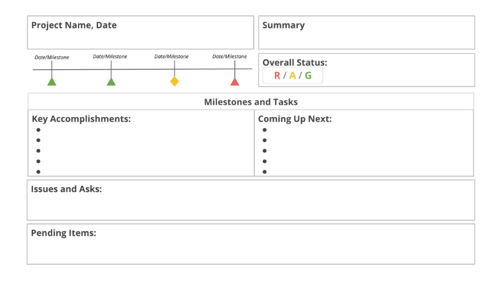

## Project status reports
In this lesson, you are learning to identify and compare various types of tracking methods. This reading will cover project status reports and how you can use them to track and communicate common project elements in a snapshot.

Key components of a project status report
A project status report gives an overview of all of the project’s common elements and summarizes them in a snapshot. It is an efficient communication tool to convey the latest status in one place for the team and stakeholders.

Most status reports contain the following components:

- Project name: The project name should be specific to the purpose of the project so that the overall goal of the project can be understood at-a-glance. 
- Date: You will create project status reports many times during the course of a project’s implementation phase. Reports can be created weekly or monthly—it all depends on the stakeholders’ needs and pace of the project. Adding the date to each status report acts as a reference point for your audience and also creates a history log of the project’s status over time. 
- Summary: The summary condenses the project’s goals, schedule, highlights, and lowlights in one central place for easy stakeholder visibility. Usually, the summary section will be followed by, or grouped with, the timeline summary and the overall project status.
- Status: As you can imagine, status is a crucial piece. The status of the project illustrates your actual progress versus your planned progress. In project management, a common way to depict this is through RAG (red, amber, green), or Red-Yellow-Green, status reporting. RAG follows a traffic light pattern to indicate progress and status. Red indicates that there are issues that need resolution and that the project may be delayed or go significantly over budget. Amber/Yellow means that there are potential issues with schedule or budget, but that the issues can likely be resolved with corrective actions. And green means the schedule and budget are doing fine and that the project is on track. You can use RAG to indicate the overall project status, as well as milestone status. Every project team and stakeholder may have a slightly different perspective on what the colors mean and how urgent it is to escalate issues when they see an amber/yellow or red status, so it’s important to make sure everyone understands what the different color statuses mean for your project.
- Milestones and tasks: A summary of the project’s major milestones thus far and current tasks helps the team and stakeholders easily visualize the progress of those elements. In a project plan, you will typically depict the tasks and milestones as ‘not started,’ ‘in progress’ or ‘completed’ at an item-by-item level. But, in the project status report, it is common to summarize these items into two categories to better communicate the status. You’ll use key accomplishments to detail what has happened, and upcoming to detail what big milestones you will accomplish next.
- Issues: The issues include your project's current roadblocks and potential risks. Status reports are an important opportunity to set expectations with your stakeholders. If your project status is red or amber, you can flag what is preventing you from being where you planned to be. You can also use this opportunity to state your plan to get the project back to green, and ask for any resources or help you may need to do so. You will learn more about communicating big risks and issues in the upcoming videos.
## Project status report types 
With those key elements in mind, you can format your report in a variety of ways depending on your audience and what you need to communicate. 

If you need to share a status report with your team for a project that contains multiple layers of complexity, it may be best to format the report in a spreadsheet in order to keep track of all the moving parts. 

If you simply need to communicate updates to senior stakeholders, your status report may be best formatted as a slideshow, like the one below, containing only an overview of the most key points.

## Key takeaways
To recap, project status reports are a powerful tool to:
Improve and simplify communication across the team.
Keep everyone, including key stakeholders, informed.
Request more resources and support (if needed).
Create structure and transparency by recording the project status in a centralized place.

# es
## Informes de estado del proyecto
En esta lección, aprenderá a identificar y comparar varios tipos de métodos de seguimiento. Esta lectura cubrirá los informes de estado del proyecto y cómo puede utilizarlos para seguir y comunicar elementos comunes del proyecto en una instantánea.

Componentes clave de un informe de estado del proyecto
Un informe de estado del proyecto ofrece una visión general de todos los elementos comunes del proyecto y los resume en una instantánea. Es una herramienta de comunicación eficaz para transmitir el estado más reciente en un solo lugar para el equipo y las partes interesadas.

La mayoría de los informes de estado contienen los siguientes componentes:

- Nombre del proyecto: El nombre del proyecto debe ser específico para el propósito del proyecto, de modo que el objetivo general del proyecto pueda entenderse de un vistazo. 
- Fecha: A lo largo de la fase de ejecución de un proyecto, se crearán informes de estado muchas veces. Los informes pueden crearse semanal o mensualmente, todo depende de las necesidades de los interesados y del ritmo del proyecto. Añadir la fecha a cada informe de estado sirve de punto de referencia para su audiencia y también crea un registro histórico del estado del proyecto a lo largo del tiempo. 
- Resumen: El resumen condensa los objetivos, el calendario, los aspectos destacados y los puntos débiles del proyecto en un lugar central para facilitar la visibilidad de las partes interesadas. Normalmente, la sección de resumen irá seguida o agrupada con el resumen de la línea de tiempo y el estado general del proyecto.
- Estado: Como puedes imaginar, el estado es una pieza crucial. El estado del proyecto ilustra el progreso real en comparación con el planificado. En la gestión de proyectos, una forma común de representar esto es a través de los informes de estado RAG (rojo, ámbar, verde), o rojo-amarillo-verde. El RAG sigue un patrón de semáforo para indicar el progreso y el estado. El rojo indica que hay problemas que deben resolverse y que el proyecto puede retrasarse o sobrepasar considerablemente el presupuesto. Ámbar/Amarillo significa que hay problemas potenciales con el calendario o el presupuesto, pero que es probable que los problemas puedan resolverse con acciones correctivas. Y verde significa que el calendario y el presupuesto van bien y que el proyecto está en marcha. Puede utilizar el RAG para indicar el estado general del proyecto, así como el estado de los hitos. Cada equipo de proyecto y cada parte interesada puede tener una perspectiva ligeramente diferente sobre el significado de los colores y sobre la urgencia de escalar los problemas cuando ven un estado ámbar/amarillo o rojo, por lo que es importante asegurarse de que todo el mundo entiende lo que significan los diferentes estados de color para su proyecto.
- Hitos y tareas: Un resumen de los principales hitos del proyecto hasta el momento y de las tareas actuales ayuda al equipo y a las partes interesadas a visualizar fácilmente el progreso de esos elementos. En un plan de proyecto, se suelen representar las tareas y los hitos como "no iniciados", "en curso" o "completados" a nivel de elemento por elemento. Pero, en el informe de situación del proyecto, es habitual resumir estos elementos en dos categorías para comunicar mejor el estado. Utilizarás los logros clave para detallar lo que ha sucedido, y los próximos para detallar los grandes hitos que cumplirás a continuación.
- Problemas: Los temas incluyen los obstáculos actuales de su proyecto y los riesgos potenciales. Los informes de estado son una oportunidad importante para establecer las expectativas de las partes interesadas. Si el estado de tu proyecto es rojo o ámbar, puedes señalar qué es lo que te impide estar donde habías planeado. También puede aprovechar esta oportunidad para exponer su plan para que el proyecto vuelva a estar en verde, y pedir los recursos o la ayuda que pueda necesitar para ello. En los próximos vídeos aprenderás más sobre cómo comunicar los grandes riesgos y problemas.
## Tipos de informes de estado del proyecto 
Con estos elementos clave en mente, puedes dar formato a tu informe de varias maneras, dependiendo de tu audiencia y de lo que necesites comunicar. 

Si necesitas compartir un informe de estado con tu equipo para un proyecto que contiene múltiples niveles de complejidad, puede ser mejor formatear el informe en una hoja de cálculo para poder hacer un seguimiento de todas las partes en movimiento. 

Si sólo tiene que comunicar las actualizaciones a las partes interesadas de alto nivel, su informe de estado puede estar mejor formateado como una presentación de diapositivas, como la que se muestra a continuación, que contiene sólo una visión general de los puntos más importantes.

## Puntos clave
Recapitulando, los informes de estado del proyecto son una poderosa herramienta para
Mejorar y simplificar la comunicación en todo el equipo.
Mantener informados a todos, incluidos los principales interesados.
Solicitar más recursos y apoyo (si es necesario).
Crear estructura y transparencia al registrar el estado del proyecto en un lugar centralizado.